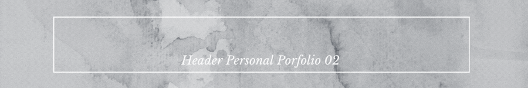

  

¡Hola! 👋 Bienvenido a mi repositorio. Soy Ferran Coll, un apasionado del desarrollo web, y este proyecto exhibe un ejemplo de mi trabajo con HTML y CSS, utilizando Sass para crear un header responsive destinado a un portafolio personal. El diseño está optimizado para pantallas de 1200px de ancho.

## Tabla de Contenidos
- [Contenido del Repositorio](src)
- [Vista Previa](#-vista-previa)
- [Recursos Utilizados](https://fonts.google.com/)
- [Contribuciones](https://github.com/notifications)
- [Trabajo Freelance](mailto:ferrancolllopez@gmail.com)
- [Licencia](LICENCIA)

## 📁 Contenido del Repositorio

Este proyecto incluye un header con enlaces a diferentes secciones, diseñado para un portafolio personal. Utilizo las siguientes tecnologías:

| Tecnología | Enlace |
|------------|--------|
| **HTML**   |  |
| **CSS**    |  |
| **SASS**   |  |
