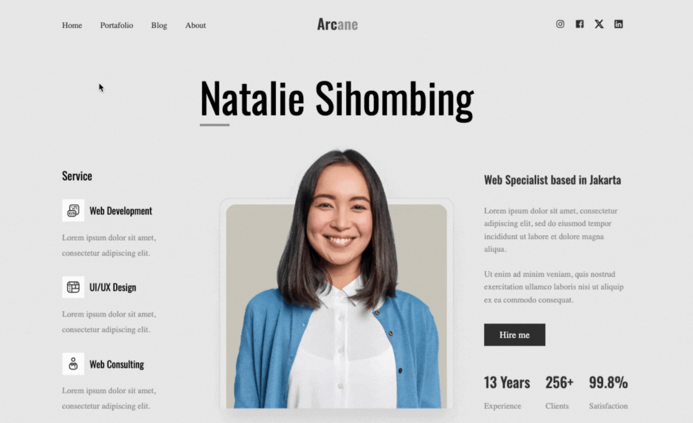

  

---

¡Hola! 👋 Bienvenido a mi repositorio. Soy Ferran Coll, un apasionado del desarrollo web, y este proyecto exhibe un ejemplo de mi trabajo con HTML y CSS, utilizando Sass para crear un header responsive destinado a un portafolio personal. El diseño está optimizado para pantallas de 1200px de ancho.

## Tabla de Contenidos
- [Contenido del Repositorio](src)
- [Vista Previa](vista-previa.png)
- [Recursos Utilizados](https://fonts.google.com/)
- [Contribuciones](https://github.com/notifications)
- [Trabajo Freelance](mailto:ferrancolllopez@gmail.com)
- [Licencia](LICENCIA)

## 📁 Contenido del Repositorio

Este proyecto incluye un header con enlaces a diferentes secciones, diseñado para un portafolio personal. Utilizo las siguientes tecnologías:

| Tecnología | Enlace |
|------------|--------|
| **HTML**   |  |
| **CSS**    |  |
| **SASS**   |  |

## 🖼️ Vista Previa con Hover

  

## 🛠️ Recursos Utilizados

🌐 **Google Fonts:** Se utilizan las fuentes Poppins y Bebas Neue para darle un toque elegante al diseño.

## 🎨 Personalización

Siéntete libre de personalizar el proyecto según tus necesidades. ¡Agrega tu propio toque creativo y comparte el resultado final!

## Contribuciones 🤝

¡Contribuciones y sugerencias son bienvenidas! Si encuentras problemas, tienes ideas para mejoras o simplemente quieres participar, por favor, abre un [nuevo issue](https://github.com/Ferran226/HTML-CSS-SASS-Header-Personal-Porfolio-02/issues) o envía una [solicitud de extracción](https://github.com/Ferran226/HTML-CSS-SASS-Header-Personal-Porfolio-02/pulls). Estoy ansioso por colaborar contigo y mejorar este proyecto juntos.

## Trabajo Freelance 💼

---

  

---

Estoy disponible para trabajar en proyectos de diseño web, ya sea para particulares o empresas. Si necesitas ayuda con el diseño de tu sitio web o tienes algún proyecto en mente, ¡no dudes en contactarme en 
 

## Licencia 📜

Este proyecto está bajo la licencia [MIT] - Consulta el archivo [LICENSE](LICENSE) para más detalles.
